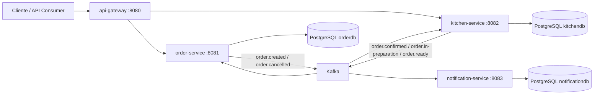

# Order Flow

Sistema de gestao de pedidos orientado a eventos para restaurantes, implementado como monorepo Maven com microservicos Spring Boot, Kafka e PostgreSQL.

## Arquitetura



## Servicos

| Servico | Porta | Responsabilidade |
| --- | --- | --- |
| `api-gateway` | `8080` | Entrada unica e roteamento para os servicos internos |
| `order-service` | `8081` | Criacao, consulta, cancelamento e atualizacao de status de pedidos |
| `kitchen-service` | `8082` | Geracao e atualizacao de tickets da cozinha |
| `notification-service` | `8083` | Consumo de eventos para persistir e registrar notificacoes mock |
| `kafka` | `29092` | Broker para comunicacao assincrona |

## Stack

- Java 21
- Spring Boot 3.2.12
- Spring Cloud Gateway 2023.0.5
- Spring Data JPA
- Spring Kafka
- PostgreSQL 15
- Flyway
- Docker Compose
- JUnit 5, Mockito, Embedded Kafka e Testcontainers

## Estrutura do Monorepo

```text
orderflow/
|-- orderflow-contracts
|-- order-service
|-- kitchen-service
|-- notification-service
`-- api-gateway
```

`orderflow-contracts` centraliza os contratos dos eventos Kafka e o suporte compartilhado de correlacao.

## Pre-requisitos

- Java 21
- Docker e Docker Compose
- Maven Wrapper disponivel no repositorio (`./mvnw` ou `mvnw.cmd`)

## Como executar

Para subir toda a stack:

```bash
docker compose up --build
```

Servicos disponiveis apos o bootstrap:

- Gateway: `http://localhost:8080`
- Order Service: `http://localhost:8081`
- Kitchen Service: `http://localhost:8082`
- Notification Service: `http://localhost:8083`

## Fluxo principal do MVP

1. O cliente cria um pedido no `order-service` via gateway.
2. O `order-service` persiste o pedido como `PENDING` e publica `order.created`.
3. O `kitchen-service` consome o evento, cria o ticket e publica `order.confirmed`.
4. O `kitchen-service` pode evoluir o ticket para `IN_PREPARATION` e `READY`, publicando os eventos correspondentes.
5. O `order-service` consome os eventos da cozinha e atualiza o status do pedido.
6. O `notification-service` projeta o e-mail do cliente e persiste notificacoes mock para `ORDER_CONFIRMED`, `ORDER_READY` e `ORDER_CANCELLED`.

## Endpoints principais

### Criar pedido

```bash
curl -X POST http://localhost:8080/api/v1/orders \
  -H "Content-Type: application/json" \
  -d '{
    "customerName": "Joao Silva",
    "customerEmail": "joao@email.com",
    "items": [
      {
        "productId": "11111111-1111-1111-1111-111111111111",
        "productName": "X-Burger",
        "quantity": 2,
        "unitPrice": 25.90
      }
    ]
  }'
```

### Buscar pedido

```bash
curl http://localhost:8080/api/v1/orders/{orderId}
```

### Listar pedidos por status

```bash
curl "http://localhost:8080/api/v1/orders?status=IN_PREPARATION"
```

### Cancelar pedido

```bash
curl -X DELETE http://localhost:8080/api/v1/orders/{orderId} \
  -H "Content-Type: application/json" \
  -d '{"reason":"Cliente desistiu"}'
```

### Listar tickets da cozinha

```bash
curl http://localhost:8080/api/v1/kitchen/tickets
```

### Atualizar status do ticket

```bash
curl -X PATCH http://localhost:8080/api/v1/kitchen/tickets/{ticketId}/status \
  -H "Content-Type: application/json" \
  -d '{"status":"READY"}'
```

## Eventos Kafka

| Topico | Publicado por | Consumido por |
| --- | --- | --- |
| `order.created` | `order-service` | `kitchen-service`, `notification-service` |
| `order.confirmed` | `kitchen-service` | `order-service`, `notification-service` |
| `order.in-preparation` | `kitchen-service` | `order-service` |
| `order.ready` | `kitchen-service` | `order-service`, `notification-service` |
| `order.cancelled` | `order-service` | `kitchen-service`, `notification-service` |

## Decisoes arquiteturais

- Hexagonal architecture: os servicos de dominio foram organizados com portas e adapters para isolar regra de negocio de HTTP, Kafka e JPA.
- Kafka: a comunicacao assincrona reduz acoplamento entre `order-service`, `kitchen-service` e `notification-service`.
- PostgreSQL por servico: cada microservico mantem sua propria base, reforcando autonomia e evitando acoplamento por schema compartilhado.
- Flyway: o versionamento do schema fica rastreavel junto ao codigo.
- Idempotencia: consumidores persistem `processed_events` para evitar reprocessamento de mensagens duplicadas.
- Correlation ID: logs carregam `correlationId` para facilitar rastreamento do fluxo entre servicos.

## Testes

Executa todos os testes do monorepo:

```bash
./mvnw test
```

Cobertura incluida no MVP:

- testes unitarios de dominio e application services
- testes de integracao REST com H2
- testes Kafka com Embedded Kafka
- testes JPA com Testcontainers quando Docker esta disponivel
- testes do gateway com `WebTestClient`

## Observacoes do MVP

- O status `DELIVERED` existe no dominio do pedido, mas ainda nao participa do fluxo automatizado.
- O `notification-service` realiza envio mock via log estruturado e persistencia, sem canal WebSocket nesta primeira versao.
